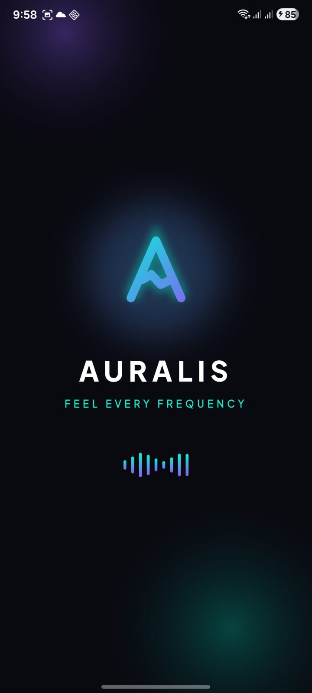
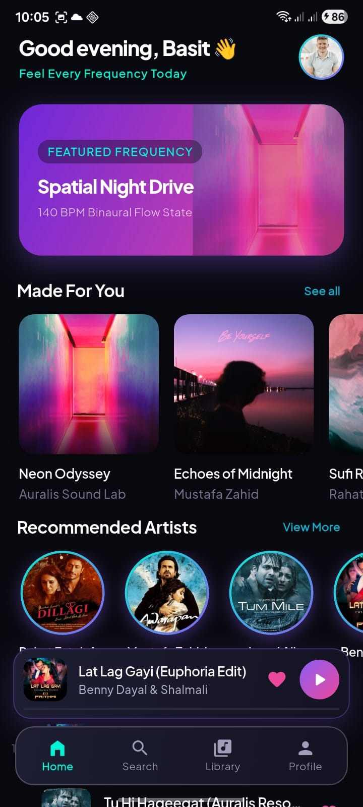
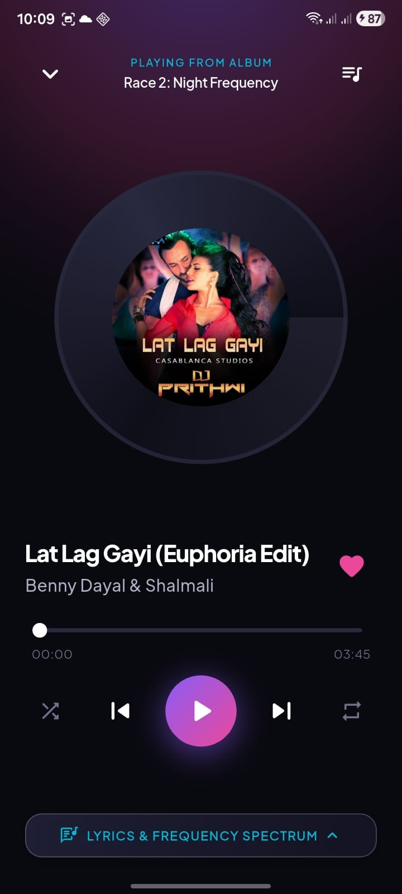

# 🎧 Auralis — Flutter Music Player

Auralis is a modern music player application built with **Flutter and Dart**. It provides a clean music-listening experience with local audio playback, custom UI, animations, album artwork, and a centralized audio controller shared across screens.

This project was built as a hands-on Flutter project to improve my understanding of **UI development, navigation, audio playback, state handling, reusable widgets, and animations**.

---

## 📱 Screenshots

<table align="center">
  <tr>
    <td align="center">
      
      <br />
      <b>Splash Screen</b>
    </td>
    <td align="center">
      
      <br />
      <b>Home Screen</b>
    </td>
    <td align="center">
      
      <br />
      <b>Song Screen</b>
    </td>
  </tr>
</table>

---

## ✨ Features

* 🎵 Local music playback
* ▶️ Play and pause songs
* ⏭️ Next and previous song controls
* 🎚️ Music progress slider
* 🎨 Modern dark-themed UI
* 🖼️ Album artwork
* ✨ Animated UI elements
* 🎧 Centralized audio controller
* 🔄 Shared audio controller between screens
* 📱 Responsive Flutter UI
* 💫 Lottie animated splash screen
* ⚡ Smooth navigation between screens
* 🎶 Play songs directly from the Home Screen

---

## 🛠️ Technologies & Packages

| Technology   | Usage                   |
| ------------ | ----------------------- |
| Flutter      | Application development |
| Dart         | Programming language    |
| AudioPlayers | Audio playback          |
| Google Fonts | Custom typography       |
| Lottie       | Splash screen animation |

---

## 🎧 Audio Controller

Auralis uses a centralized `AudioController` instead of creating separate audio players for each screen.

The controller is responsible for:

* Playing songs
* Pausing songs
* Resuming songs
* Stopping songs
* Tracking the current song
* Tracking playback state
* Detecting when a song finishes

The same `AudioController` is shared between the **Home Screen** and **Song Screen**.

This prevents multiple audio players from running independently and allows the user to control the same currently playing song from different parts of the application.

---

## 📂 Project Structure

```text
lib/
│
├── controllers/
│   └── audio_controller.dart
│
├── model/
│   └── song_model.dart
│
├── screens/
│   ├── splash_screen.dart
│   ├── home_screen.dart
│   └── song_screen.dart
│
├── widiget/
│   ├── album_widiget.dart
│   └── equalizer_widget.dart
│
├── app_background.dart
│
└── main.dart
```

### Folder Explanation

#### `controllers/`

Contains application controllers.

```text
audio_controller.dart
```

Handles the application's audio playback.

#### `model/`

Contains data models.

```text
song_model.dart
```

Defines the `Song` model and the song list used by the application.

#### `screens/`

Contains the main application screens.

```text
splash_screen.dart
home_screen.dart
song_screen.dart
```

#### `widiget/`

Contains reusable UI components such as:

* Album widgets
* Equalizer animation

> Note: The folder is currently named `widiget` in the project.

#### `app_background.dart`

Contains the reusable application background UI.

#### `main.dart`

The entry point of the Flutter application.

---

## 🚀 Getting Started

### Prerequisites

Make sure you have installed:

* Flutter SDK
* Dart SDK
* Android Studio or VS Code
* An Android emulator or physical device

Check your Flutter installation:

```bash
flutter doctor
```

---

### 1. Clone the Repository

```bash
git clone YOUR_GITHUB_REPOSITORY_URL
```

### 2. Open the Project

```bash
cd auralis
```

### 3. Install Dependencies

```bash
flutter pub get
```

### 4. Run the Application

```bash
flutter run
```

---

## 🎵 Adding Music

Songs are stored as local assets.

Example project structure:

```text
assets/
├── images/
│   ├── album_1.jpg
│   ├── album_2.jpg
│   └── ...
│
├── songs/
│   ├── song_1.mp3
│   ├── song_2.mp3
│   └── ...
│
└── splash.json
```

A song can be added to the `songList` using the `Song` model:

```dart
const Song(
  title: 'Song Name',
  artist: 'Artist Name',
  songPath: 'assets/songs/song.mp3',
  imagePath: 'assets/images/song.jpg',
);
```

Make sure the assets are registered inside `pubspec.yaml`.

Example:

```yaml
flutter:
  assets:
    - assets/songs/
    - assets/images/
    - assets/splash.json
```

Then run:

```bash
flutter pub get
```

---

## 🎼 How Audio Playback Works

The application uses the `audioplayers` package for local audio playback.

The basic flow is:

```text
User selects song
       ↓
Home Screen / Song Screen
       ↓
AudioController
       ↓
AudioPlayer
       ↓
Local MP3 Asset
       ↓
Music Playback
```

When another song is selected, the controller starts the new song using the same `AudioPlayer`.

---

## 🧠 What I Learned

Building Auralis helped me understand several important Flutter concepts:

* Flutter widget composition
* Stateful widgets
* `setState()`
* `ListView.builder`
* Passing data between screens
* Navigation using `Navigator`
* Local asset management
* Audio playback with `audioplayers`
* Creating reusable widgets
* Building custom UI components
* Managing audio state
* Sharing a controller between screens
* Working with animations
* Lottie animations
* Custom gradients and shadows
* Debugging Flutter rendering issues

One of the most important parts of this project was learning how to use a **single audio controller across multiple screens** rather than creating separate audio players.

---

## 🔮 Future Improvements

Possible improvements for future versions include:

* 🔀 Shuffle mode
* 🔁 Repeat mode
* ❤️ Favorite songs
* 📋 Custom playlists
* 🔍 Song search
* 🔊 Volume control
* 🎼 Lyrics support
* 💾 Persistent playback state
* 🌐 Online music streaming
* 🔔 Background audio playback
* 🎧 Lock-screen media controls

---

## 👨‍💻 Developer

### Abdul Basit

Flutter Developer focused on building mobile applications with Flutter and Dart.

I'm continuously improving my development skills by building real-world applications and experimenting with different Flutter concepts.

---

## ⭐ Support

If you like the project or find it useful, consider giving the repository a ⭐.

Feedback, suggestions, and improvements are welcome.

---

## 📄 License

This project was created for **learning and portfolio purposes**.

The music files, images, fonts, animations, and other third-party assets may belong to their respective owners. Make sure you have the necessary rights or permissions before distributing copyrighted assets.

---

## 📌 Project Status

**Status:** Completed ✅

Auralis is currently a completed learning/portfolio project, with additional features planned for future versions.
